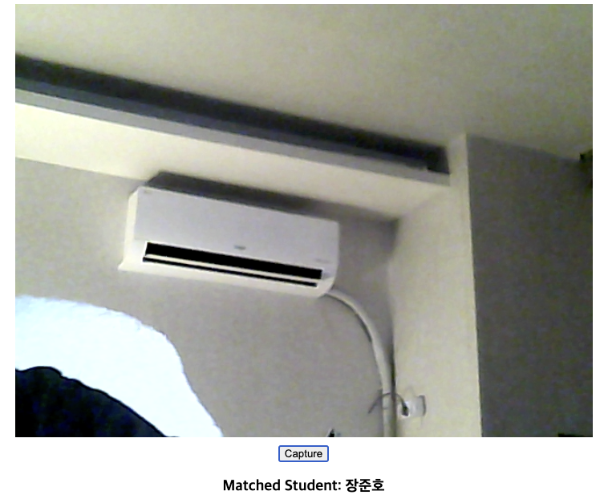

# Face_recognition_attendance_check

## 얼굴인식(face-api.js)를 이용한 출석체크
사용 라이브러리
tinyFaceDetector
faceLandmark68Net
faceRecognitionNet
ssdMobilenetv1

## 사용화면

- 캡쳐버튼 누르면 얼굴을 인식합니다

Database에 해당 얼굴에 대한 faceDescriptor가 존재하면, 해당하는 학생의 Table에 해당 이미지와 faceDescriptor정보를 추가합니다.
또한, 출석정보를 갱신하여 출석을 확인합니다.


## 사용 Stack
DB: MongoDB   
FrontEnd: React   
backEnd: NodeJS   

## 프로젝트 구조
```arduino

face-recognition-attendance
├── backend
│   ├── models
│   │   ├── attendance.js // 출석 정보
│   │   └── student.js // 학생 정보
│   ├── routes
│   │   └── students.js
│   ├── app.js
│   └── config.js
├── frontend
│   ├── public
│   ├── src
│   │   ├── components
│   │   │   ├── Camera.js // 얼굴인식 처리
│   │   │   └── StudentList.js // 처리된 이미지 View및 출석확인 View
│   │   ├── App.js
│   │   ├── index.js
│   │   └── services
│   │       └── api.js // node.js 연결
└── package.json
```